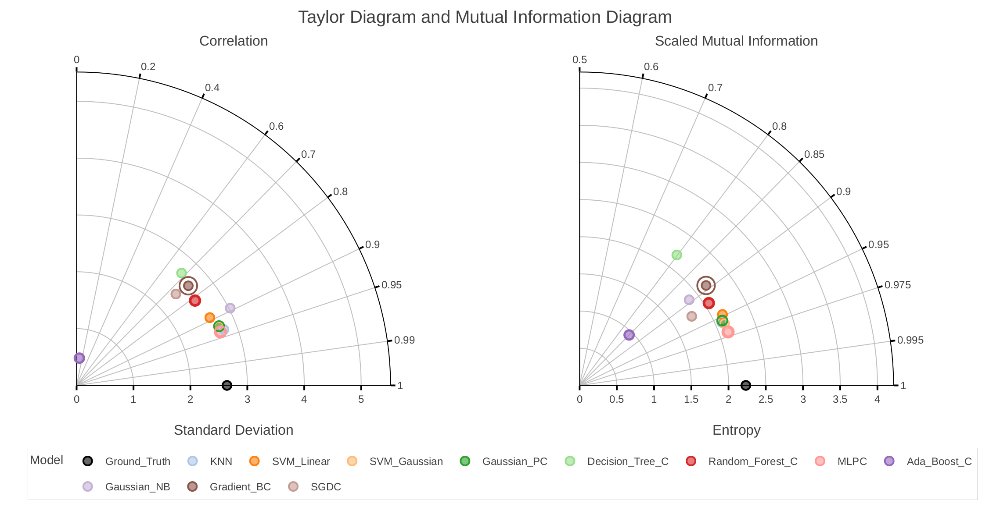
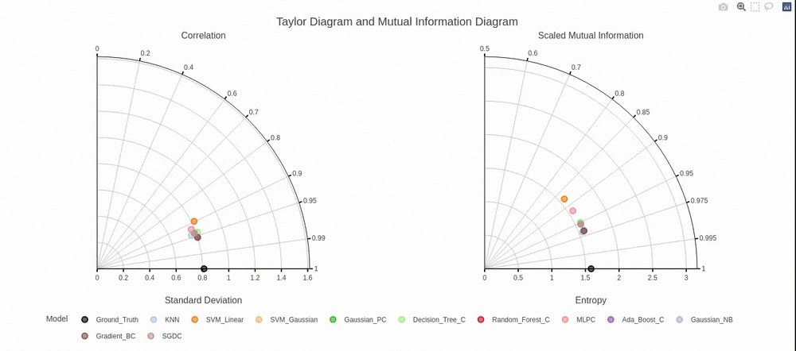

# Polar Diagrams for Model Comparison

## Manuscript

This library is created for the following paper:

***"Name of the paper"*** by Aleksandar Anžel, Dominik Heider, and Georges Hattab

Please cite the paper as:
```latex
Bibtex citation placeholder
```

---
Abstract:

> Abstract placeholder


## Dependencies

The code is written in Python 3.9.15 and tested on Linux with the following libraries installed:

|Library|Version|
|---|---|
|numpy|1.23.5|
|pandas|1.5.2|
|scikit-learn|1.2.0|
|scipy|1.9.3|
|plotly|5.9.0|
|kaleido|0.2.1|

The dependencies can also be found in [requirements.txt](requirements.txt).

## Data
|Location|Description|
|---|---|
|[Data/](./Data/)|contains all datasets used in [Source/main.ipynb](./Source/main.ipynb).
|[Data/Dataset_0/](./Data/Dataset_0/)|contains the Anscombe's quartet data set.
|[Data/Dataset_1/](./Data/Dataset_1/)|contains the official, automatically generated script for downloading the CMIP3 data from the [https://esgf-node.llnl.gov/projects/cmip3/](https://esgf-node.llnl.gov/projects/cmip3/). To generate the whole data set, the user should first place itself into this directory and then run the following command from the terminal `sh generate_dataset_1.sh`. [1]
|[Data/Dataset_2/](./Data/Dataset_2/)|contains the data set from the subsection *3.2 Example 2 — Machine Learning Model Evaluation* of our paper.


**[1]** The script used for downloading the [Dataset_1/](./Data/Dataset_1/) was generated using the tutorial found here [https://esgf.github.io/esgf-user-support/faq.html#how-to-preserve-the-directory-structure](https://esgf.github.io/esgf-user-support/faq.html#how-to-preserve-the-directory-structure).
Script can be automatically generated and downloaded again from here [https://esgf-data.dkrz.de/esg-search/wget?download_structure=model&project=CMIP3&experiment=historical&ensemble=run1&variable=ts](https://esgf-data.dkrz.de/esg-search/wget?download_structure=model&project=CMIP3&experiment=historical&ensemble=run1&variable=ts).

## Code
|Source Code|Description|
|---|---|
|[Source/](./Source/)|contains all scripts.
|[Source/main.ipynb](./Source/main.ipynb)|contains the IPython (jupyter) notebook that demonstrates the library using multiple datasets.
|[Source/polar_diagrams/diagrams.py](./Source/polar_diagrams/diagrams.py)|contains the source code that imports the data, modifies it, calculates statistical and information theory properties, and builds diagrams.
|[Source/test.py](./Source/test.py)|contains the source code for all unit tests.

## Getting started

### The Scalar Feature


### Interactive aspects



## Installation & Running
### Stable

### Unstable

## License

Licensed under the GNU General Public License, Version 3.0 ([LICENSE](./LICENSE) or https://www.gnu.org/licenses/gpl-3.0.en.html)

### Contribution

Any contribution intentionally submitted for inclusion in the work by you, shall be licensed under the GNU GPLv3.
